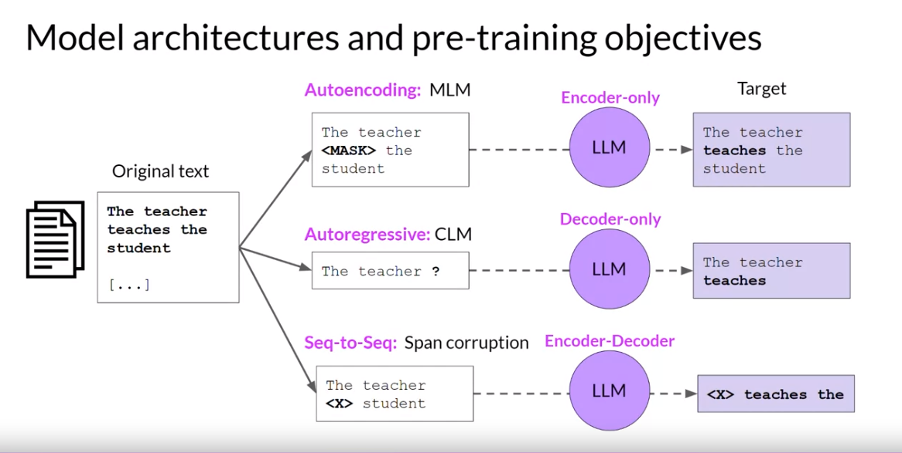
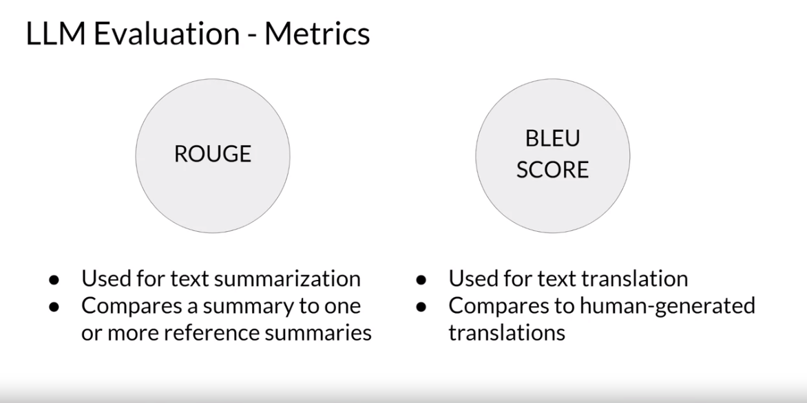
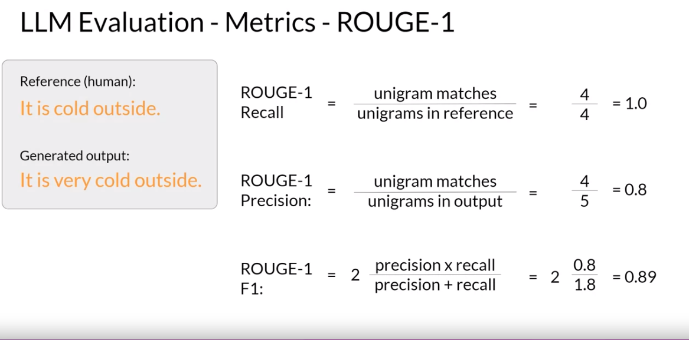
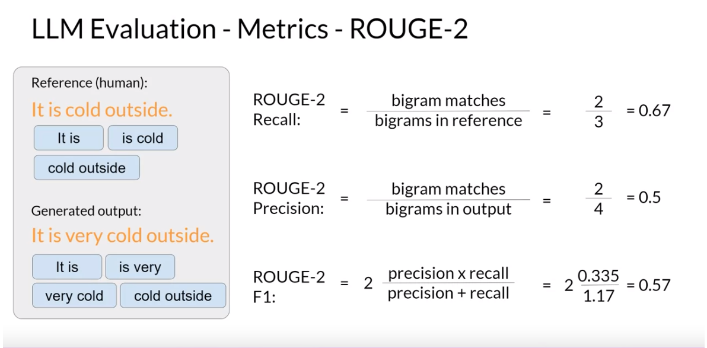
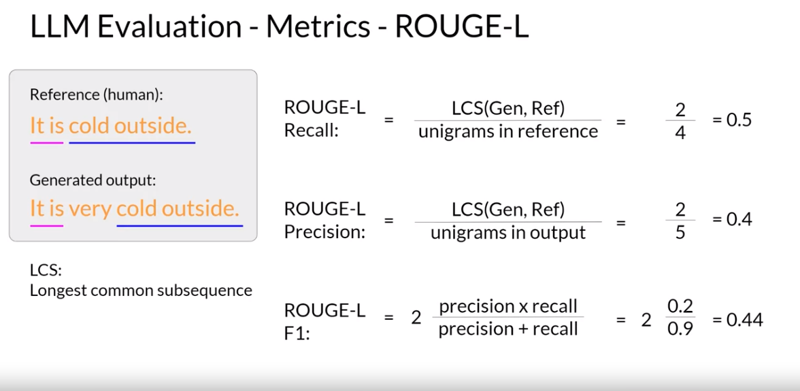
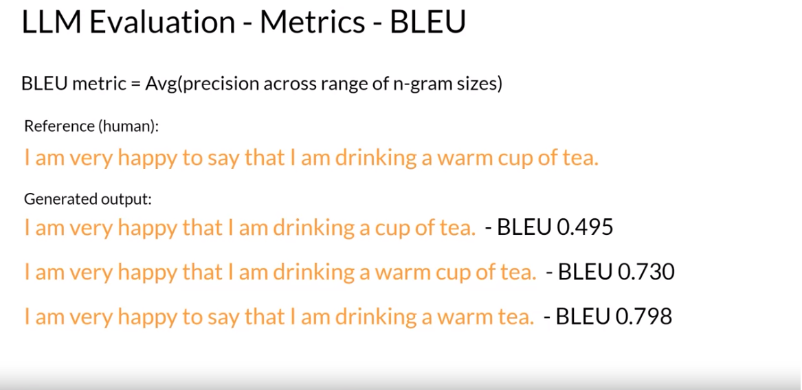

# Generative-AI-with-LLM
## Notes

### Model: 
 there were three variance of the transformer model; **encoder-only** **encoder-decoder** models, and **decode-only**. 
 Each of these is trained on a different objective, and so learns how to carry out different tasks. 
 - **Encoder-only models** are also known as **Autoencoding models**, and they are pre-trained using masked language modeling. Here, tokens in the input sequence or randomly mask, and the training objective is to predict the mask tokens in order to reconstruct the original sentence. 
 This is also called a denoising objective. 
 **Autoencoding models** spilled bi-directional representations of the input sequence, meaning that the model has an understanding of the full context of a token and not just of the words that come before. 
 **Encoder-only models** are ideally suited to task that benefit from this bi-directional contexts. You can use them to carry out sentence classification tasks, for example, `sentiment analysis` or token-level tasks like `named entity recognition` or `word classification`. Some well-known examples of an autoencoder model are **BERT** and **RoBERTa**. 
 
 - **decoder-only** or **autoregressive models**, which are pre-trained using causal language modeling. 
 Here, the training objective is to predict the next token based on the previous sequence of tokens. 
 Predicting the next token is sometimes called full language modeling by researchers. **Decoder-based autoregressive models**, mask the input sequence and can only see the input tokens leading up to the token in question. 
 The model has no knowledge of the end of the sentence. The model then iterates over the input sequence one by one to predict the following token. In contrast to the encoder architecture, this means that the context is unidirectional. 
 By learning to predict the next token from a vast number of examples, the model builds up a statistical representation of language. Models of this type make use of the decoder component off the original architecture without the encoder. 
 **Decoder-only models** are often used for text generation, although larger **decoder-only models** show strong zero-shot inference abilities, and can often perform a range of tasks well. Well known examples of decoder-based autoregressive models are **GBT** and **BLOOM**. 
 
 - The final variation of the transformer model is the **sequence-to-sequence** model that uses both the encoder and decoder parts off the original transformer architecture. The exact details of the pre-training objective vary from model to model. 
 A popular **sequence-to-sequence** model T5, pre-trains the encoder using span corruption, which masks random sequences of input tokens. Those mass sequences are then replaced with a unique Sentinel token, shown here as x. Sentinel tokens are special tokens added to the vocabulary, but do not correspond to any actual word from the input text. 
 The decoder is then tasked with reconstructing the mask token sequences auto-regressively. The output is the Sentinel token followed by the predicted tokens. You can use **sequence-to-sequence** models for translation, summarization, and question-answering. They are generally useful in cases where you have a body of texts as both input and output. Besides T5,

### Model Evaluation: 

`ROUGE` and `BLEU`, are two widely used evaluation metrics for different tasks. `ROUGE` or recall oriented under study for jesting evaluation is primarily employed to assess the quality of automatically generated summaries by comparing them to human-generated reference summaries. 
On the other hand, `BLEU`, or bilingual evaluation understudy is an algorithm designed to evaluate the quality of machine-translated text, again, by comparing it to human-generated translations. 

#### ROUGE:

#### BLEU:

### References:
Original Transformers Paper: [Attention is all you need original paper.](https://arxiv.org/pdf/1706.03762v6.pdf)
